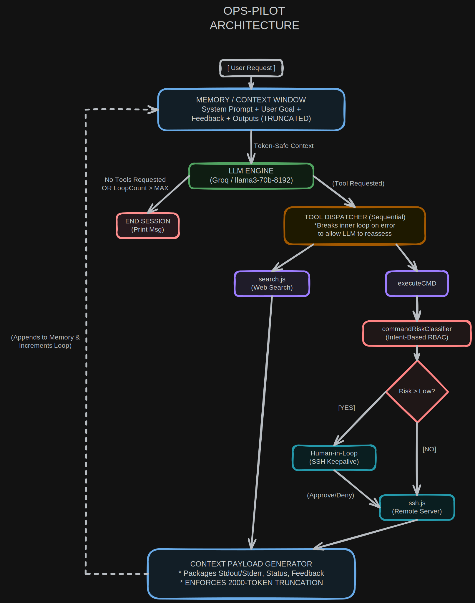

# OpsPilot

OpsPilot is an autonomous Linux operations agent that understands natural language and safely automates remote server administration. Built with LangGraph and the ReAct reasoning framework, it plans multi-step tasks, executes commands over SSH, searches the web for relevant documentation, evaluates command risk using AI, and requires human approval before performing potentially dangerous operations.

OpsPilot combines autonomous reasoning with human oversight to provide secure, reliable, and intelligent terminal automation.

---

## Architecture

<p align="center">
  
</p>

<p align="center">


---

## Features

- Autonomous task planning using the ReAct reasoning pattern
- Multi-step workflow orchestration with LangGraph
- Secure remote Linux command execution over SSH
- AI-powered command risk classification
- Human-in-the-loop approval for sensitive operations
- Integrated web search for documentation and troubleshooting
- Sequential tool execution with structured tool responses
- Context-aware conversations with output truncation
- Circuit breaker to prevent infinite reasoning loops
- Built using Node.js and OpenAI-compatible APIs (Groq)

---

## Tech Stack

- Node.js
- LangGraph
- OpenAI SDK
- Groq
- SSH2
- Tavily Search API
- JavaScript (ES Modules)

---

## Project Structure

```text
.
├── tools/
│   ├── commandRiskClassifier.tool.js
│   ├── search.tool.js
│   └── ssh.tool.js
├── agent.js
├── constants.js
├── index.js
├── llm.js
├── utils.js
├── Architecture.md
└── package.json
```

---

## Workflow

1. User provides a task in natural language.
2. The agent reasons about the task using LangGraph.
3. If external information is required, it performs a web search.
4. If terminal execution is required, the command is evaluated by the AI risk classifier.
5. Commands requiring approval are presented to the user.
6. Approved commands are executed on the remote Linux server over SSH.
7. Command outputs are truncated and returned to the agent for further reasoning.
8. The process continues until the task is completed or the circuit breaker limit is reached.

---

## Security

OpsPilot is designed with security as a primary objective.

- AI-based command risk assessment
- Human approval before executing unsafe commands
- Sequential command execution
- Remote execution only through authenticated SSH
- Circuit breaker to prevent infinite execution loops
- Structured tool responses for reliable reasoning

---

## Installation

Clone the repository.

```bash
git clone https://github.com/your-username/opspilot.git
cd opspilot
```

Install dependencies.

```bash
npm install
```

Create a `.env` file.

```env
GROQ_API_KEY=

TAVILY_API_KEY=

SSH_HOST=
SSH_PORT=22
SSH_USERNAME=
SSH_KEY_PATH=

AGENT_LLM_MODEL_NAME=
CLASSIFIER_LLM_MODEL_NAME=
```

---

## Usage

Start the agent.

```bash
npm run dev
```

Example:

```text
You: Check disk usage on the server.

You: Find why nginx is failing to start.

You: Update package lists.

You: Restart the nginx service.
```

---

## Future Improvements

- Sliding window memory using LangChain message trimming
- Multi-server operation agent
- Persistent conversation memory
- Session history
- Plugin-based tool architecture

---

## License

MIT License

---

## Author

**Prathamesh Arun Gurav**
